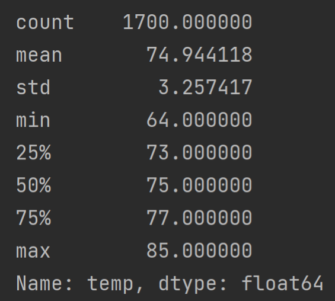
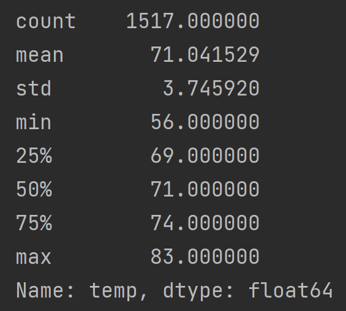

# Surfs Up Analysis
## Overview
Analyzing seasonal weather patterns across years to determine the ideal location for a Hawaiian surf and ice cream shop, and the plausibility of year-round business.
 

## Results
_Data collected from 2010-2016, all records in Fahrenheit._

|                    June                     |                    December                     |
|:-----------------------------------------------------------------:|:---------------------------------------------------------------------:|
|  |  |

**Key Differences between June and December:**
1. June is slightly hotter.
   * The average temperature is hotter in June than in December, which is not a groundbreaking discovery, but 
     still a notable observation. One may have expected as much, but now there is data to back it up.
   * However, it is important to observe that the difference is slight. There is hardly a drastic change in
     temperature between June and December, with mean temps. just 3.9 degrees apart. Of course there is more
     to it than that, but the similarity should not be ignored.
     
2. Temperature varies more greatly in December.
   * A greater difference in the datasets is their respective variations. While June temperatures tend around 
     the mid-70's (Mean = 74°F, Std. Dev = 3.26°F), December temperatures vary more widely, with the coolest days
     reaching the mid-50's (Min. = 56°F) and the hottest days approaching the mid- to low-80's (Max. = 83°F).
   * That said, the summary statistics still indicate only a slight difference between the two months, as 
     December's standard deviation is only half a degree higher than June's. So while June may be more 
     consistently warm, with a higher mean temp. and less variance, December isn't far behind. With nearly 75% 
     of temperature records at 70°F or greater, December may be a reliable month for surf shop business.
     
3. More observations in June than December.
   * Perhaps less notably, there are ~200 more records for June than for December. As there are over 1500 observations
     for both months, this may not be statistically significant, but it should still be noted. A smaller dataset is
     more prone to the influence of outliers, and with 200 fewer days of data (about 6-7 months), December summary statistics
     may be skewed.
   * For example, an abnormally cold winter would have led to a number of low-temp observations. Observations which may
     have skewed the entirety of the data by dragging down the mean temperature and lowering Q1, while widening the set's range
     and variance. And with fewer data points, this skewing would occur at a greater degree than if an abnormally hot summer
     affected June data.
   * It may be unlikely, but it is important to recognize, especially since each observation represents a day, meaning 200
     points is equivalent to several months of data.
 

## Summary
Using only the data above, I believe year-round business is sustainable on Oahu. December 
temperatures seem to hover around the mid- to low-70's, with some days even hotter, which, in comparison
to June, would indicate only a slightly cooler island in the winter.

However, I also believe further research is necessary before making a decision. There is more to consider than
just the average temperatures in June and December. First, there are 10 other months of the year that must be 
analyzed if year-round sustainability is in question. Second, this shop will have one location, so it's important
to know _where_ these temperatures are being recorded, as the observations come from a number of stations, which and
the temperature could be different at each one. Finally, there are other factors that influence the weather. Taking
the above data as an example, the temperature might be similar in June and December, but humidity plays a huge role in
how it _feels_ outside. A hot, steamy day in June might be a cool, breezy day in December, even if they are both 74°F.

I think this is a great start, but there is more work to be done if these initial conclusions are to be validated. A great
place to start would be querying data for each station, for humidity, and for all 12 months.
